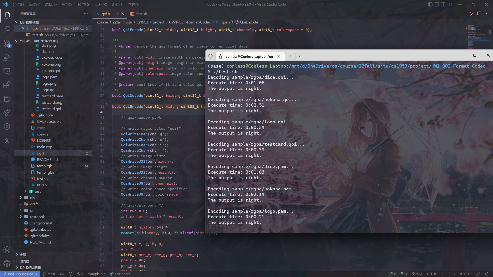
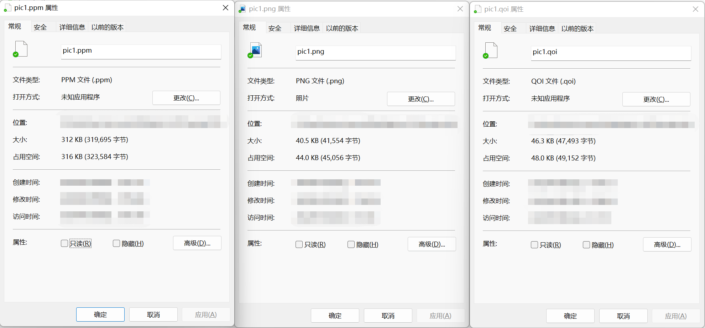

# QOI Format —— 相当好的全新图像压缩详解

该项目是上海交通大学致远学院 ACM 班的第一次程序设计大作业, 笔者在助教的讲解中了解到了 QOI 的实现原理和方法, 并补充了作业中的部分核心代码, 下面对其原理与代码进行讲解.

原项目地址: https://github.com/phoboslab/qoi
大作业地址: https://github.com/ACMClassCourse-2022/QOI-Format-Codec
实现方案: https://github.com/Conless/HW1-QOI-Format-Codec

## 简介

QOI (The Quite OK Image Format, "相当好"的图像格式) 是一种全新的图像无损压缩规范, 由 Dominic Szablewski 发明并于 2021 年 11 月 24 日首次宣布. 这是一种比 PNG 更容易实现, 更快, 无损的压缩方式, 开源于 [Github](https://github.com/phoboslab/qoi). 官方公告与视频显示, 其编码速度比 PNG 格式快 20-50 倍, 解码速度快 3-4 倍, 压缩大小与 PNG 相似.

结合 [油管视频](https://www.youtube.com/watch?v=EFUYNoFRHQI) 观看效果更佳.

## 粗成品

都说了是"相当好"了, 没有成品怎么能让人相信呢




相差无几的压缩率, 超高的压缩速度!

## 原理

我们知道, 相比于 JPEG 的有损压缩, PNG 能够通过记录每一个像素点的完整信息来达到恢复图像原始信息的目的. 其使用前向引用的方式进行压缩, 根本原理是实现对此前出现过的像素点或像素组合的复现, 并通过图像特征决定滤波器的选择和使用, 最大限度地压缩图像大小. 但所谓有得必有失, PNG 图像在压缩的过程中需要大量检索前向引用与图像特征, 造成了较大的时间损耗. 

于是, QOI 应运而生, 其编码过程只需要读取此前的一个像素点, 而不用大量检索, 同时还进行了极致的空间压缩, 实现了时间与空间的统一. 下面介绍其编码解码原理.

一个 QOI 文件中写入了一个 14 字节的起始标记, 若干组数据以及一个 8 字节的结束标记. 其中起始标记的构成为

```cpp
qoi_header {
    char magic[4];      // 类型标识符
    uint32_t width;     // 图像宽度
    uint32_t height;    // 图像高度
    uint8_t channels;   // 图像信息(RGB/RGBA)
    uint8_t colorspace; // alpha通道与颜色通道的信息
};
```

其中后面两个数据 (channels 与 colorspace) 只是标识符, 并不会改变编码方式. 随后图像就会从上到下, 从左到右地进行编码.


首先, 我们原样存入整张图片的第一个像素点, 即其在 RGB 三个通道上的值 (此处仅对 RGB 格式压缩说明, 下同), 可以记为

```cpp
data[0] = QOI_ORIGIN_TAG; // 原样输出的标识符
data[1] = r;
data[2] = g;
data[3] = b;
```

如果每一个都是这样输出, 那么显然会占据巨大的空间, 因此, 从第二个开始, QOI 就对像素点信息的储存进行了优化. 

首先, 如果该像素点和前一个像素点相同, 那么将会把该像素点与此后的若干个**连续**相同的像素点记为 RUN_TAG, 并放在一组信息中记录, 方式是

```cpp
data[++] = QOI_RUN_TAG | run_length; // 同时存入标识符与连续的长度
```

其中 data[++] = QOI_RUN_TAG | run_length 的意思是在新的一个 8 位无符号整型数 data 中, 前两位存储标识符, 后六位存储连续的长度. 这样一来, 相比起刚刚的第一个需要 4 个数字储存的像素点, 这里一个数字就可以储存至多**约** $2^6$ 个像素点.

接下来, 如果该像素点与前一个像素点不同, 但是又在更早的地方出现过, QOI 就会把当前位置**映射**到前面那个出现的像素点, 映射的方式自然就是计算机中最常见的散列表 (Hash table), 若能通过当前的 RGB 信息找到对应的散列表位置 index_pos, 那么就会将该像素点信息储存为

```cpp
data[++] = QOI_INDEX_TAG | index_pos; // 同时存入标识符与散列表位置
```

其中 data[++] = QOI_INDEX_TAG | index_pos 的意思是在一个新的 8 位无符号整型数 data 中, 前两位存储标识符, 后六位存储 index_pos. 这样一来, 也可以用一个数字储存 1 个像素点.

然后, 如果该像素点与前一个像素点的差距非常的小, 以至于每个通道上只需要 2 位数字就可以存下, QOI 就会转而存储它们的差值, 也就是

```cpp
if (dif_r >= -2 && dif_r <= 1 && 
    dif_g >= -2 && dif_g <= 1 && 
    dif_b >= -2 && dif_b <= 1) {
    /* if the difference of all color is small enough 
        to be written in a single char */
    data[++] = QOI_DIFF_TAG | 
               (dif_r + 2) << 4 | (dif_g + 2) << 2 | (dif_b + 2);
}
```

如代码所示, 只要各颜色通道的差值都在 -2~1 之间 (储存为 00, 01, 10, 11), 就会在前两位存储标识符, 后六位存储各通道上的差值.

再然后, 如果该像素点和前一个差距没这么小, 但仍然在各个通道上有相同的**变化趋势**, 那么 QOI 就会用两个数字储存这一像素点, 也就是

```cpp
if (dif_g >= -32 && dif_g <= 31 && 
    dif_rg >= -8 && dif_rg <= 7 && 
    dif_bg >= -8 && dif_bg <= 7) {
    // if the difference is adequate to be written in two chars
    QoiWriteU8(QOI_LUMA_TAG | (dif_g + 32));
    QoiWriteU8((dif_rg + 8) << 4 | (dif_bg + 8));
}
```

如代码所示, 如果 G 通道的差值在 -32~31 之间, 其它两通道的变化幅度与 G 通道 **变化幅度** 差值差值在 -8~7 之间, 就会在第一个数字的前两位存储标识符, 后六位存储 G 通道上的差值; 在第二个数字的前四位与后四位分别存储 RG 通道差值**的差**, BG 通道差值**的差**.

最后, 如果上面一切条件都不满足 (悲), 那就只好像第一个一样原样储存了, 也就是

```cpp
data[++] = QOI_NO_TAG
data[++] = r;
data[++] = g;
data[++] = b;
```

这样就需要用整整四个数字才能储存一个像素点.

以上就是 QOI 实现原理的全过程, 下面 ~~为了应对助教大大的 code review~~ 再进行一波代码逐行分析

## 代码分析

下面分析 [代码](https://github.com/Conless/HW1-QOI-Format-Codec) 的核心实现步骤, 以编码过程为例, 解码过程类同.

首先是主函数的核心执行架构, 无需多言.

```cpp
int main(int argc, char *argv[]) {
    if (argc <= 1) { /* error */ }
    std::map<std::string, bool> args;
    for (int i = 1; i < argc; ++i) args[argv[i]] = true;
    if (args["-h"]) { /* helpinfo */ }
    if (args["-e"] && args["-d"]) { /* conflict */ }

    std::string type = args["-4"] ? "rgba" : "rgb"; // 决定输入输出类型: RGB / RGBA
    if (args["-e"]) PnmToQoi(type, args["-o"]);     // QOI 编码
    if (args["-d"]) QoiToPnm(type, args["-o"]);     // QOI 解码
    return 0;
}
```

接下来是编码的主要几个函数, 首先是统领编码流程的函数:
```cpp
void PnmToQoi(std::string fType, bool omitted);
```

首先将原文件转换为临时文件
```cpp
auto fName = "temp." + fType;                   // 临时文件储存名
std::fstream temp;
temp.open(fName, std::ios::out | std::ios::binary | std::ios::trunc);
// .ppm/pam -> .rgb(a), 将原文件转换为临时文件
try {
    if (...)
        PpmToRgb(std::cin, temp, width, height);
    else
        PamToRgba(std::cin, temp, width, height);
} catch (...) /* error */
temp.close();
temp.open(fName, std::ios::in | std::ios::binary);
auto backup = std::cin.rdbuf();
```
接下来将临时文件转换为目标文件
```cpp
auto target = temp.rdbuf();
// .rgb(a) -> .qoi, 将临时文件转换为目标文件
std::cin.rdbuf(target);                         // 将模式切换为输入
QoiEncode(width, height, channels, 0u);         // 正式编码
std::cin.rdbuf(backup); // restore std::cin buffer
temp.close();
if (omitted) std::remove(fName.c_str());        // 删除临时文件
```

将原文件转换为临时文件的过程只是简单的写入, 在此不做展开, 下面分析包含 QOI 核心实现逻辑的目标文件写入函数:
```cpp
bool QoiEncode(uint32_t width, uint32_t height, uint8_t channels, uint8_t colorspace);
```

首先是一些比较重要的预设:
```cpp
constexpr uint8_t QOI_OP_INDEX_TAG = 0x00;
constexpr uint8_t QOI_OP_DIFF_TAG = 0x40;
constexpr uint8_t QOI_OP_LUMA_TAG = 0x80;
constexpr uint8_t QOI_OP_RUN_TAG = 0xc0;
constexpr uint8_t QOI_OP_RGB_TAG = 0xfe;
constexpr uint8_t QOI_OP_RGBA_TAG = 0xff;
```
显然, 前四个分别代表了在 data 的前两位写入 00, 01, 10, 11, 刚好占满两位. 那么后面两个呢? 它们不会和其它状态产生冲突吗? 实际上, RGB_TAG 和 RGBA_TAG, 也即刚刚的原样输出标识符, 它们只会与 RUN_TAG 产生冲突, 这样一来, 可以对 RUN_TAG 中数值的范围进行限制 (这是容易实现的, 只需要将 run_length 限制在 000000-111101, 从而保留 (11)111110, (11)111111 给剩下两个tag) 即可.

接下来是一些预设环节:
```cpp
// 写入标识符
QoiWriteChar('q'); QoiWriteChar('o'); QoiWriteChar('i'); QoiWriteChar('f');
// 写入相关信息
QoiWriteU32(width); QoiWriteU32(height); 
QoiWriteU8(channels); QoiWriteU8(colorspace);
// 定义一些重要变量
int run = 0;                        // 也即刚刚的 run_length
int px_num = width * height;        // 总像素个数
uint8_t history[64][4];             // 散列表
uint8_t r, g, b, a;                 // 当前读入的颜色信息
uint8_t pre_r, pre_g, pre_b, pre_a; // 上一个颜色信息
/* 变量预设 */
```

然后就到了函数核心部分, 首先读入目前像素位置处的 rgb(a) 颜色信息:

```cpp
for (int i = 0; i < px_num; ++i) {
    /* 读入 rgb(a) */
    /* Next Part */
}
```

然后, 优先级最高的是占用空间最少的 run 环节
```cpp
if (r == pre_r && g == pre_g && b == pre_b && a == pre_a) {
    run++;
    if (run == 62) {        // 至多写 62 个, 编号为 0-61.
        QoiWriteU8(QOI_OP_RUN_TAG | (run - 1));
        run = 0;
    }
} else {
    /* Next Part */
} 
```

如果没有~~润~~成功, 那么首先要做的是结束之前的润, 并且将润的最终结果写入 data.
```cpp
else {
    if (run > 0) {
        QoiWriteU8(QOI_OP_RUN_TAG | (run - 1));
        run = 0;
    }
    /* Next Part */
}
```
优先级次高的是散列表寻值并写入单个像素点.
```cpp
// get hash value
int index_pos = QoiColorHash(r, g, b, a) % 64;
if (history[index_pos][0] == r && history[index_pos][1] == g && history[index_pos][2] == b && history[index_pos][3] == a) {
    QoiWriteU8(QOI_OP_INDEX_TAG | index_pos);
} else {
    /* Next Part */
}
```
如果找不到的话, 那么先将其计入散列表, 以便下次使用
```cpp
history[index_pos][0] = r;
history[index_pos][1] = g;
history[index_pos][2] = b;
history[index_pos][3] = a;
```
随后, 如果是 RGBA 模式就只能直接写入了, 如果是 RGB 模式就可以寻求进一步压缩的方案, 具体实现原理就跟上面说的完全一致.
```cpp
int8_t dif_r = r - pre_r;
int8_t dif_g = g - pre_g;
int8_t dif_b = b - pre_b;

int8_t dif_rg = dif_r - dif_g;
int8_t dif_bg = dif_b - dif_g;

if (dif_r >= -2 && dif_r <= 1 && 
    dif_g >= -2 && dif_g <= 1 && 
    dif_b >= -2 && dif_b <= 1) {
    QoiWriteU8(QOI_OP_DIFF_TAG | (dif_r + 2) << 4 | (dif_g + 2) << 2 | (dif_b + 2));
} else if (dif_g >= -32 && dif_g <= 31 && 
    dif_rg >= -8 && dif_rg <= 7 && 
    dif_bg >= -8 && dif_bg <= 7) {
    QoiWriteU8(QOI_OP_LUMA_TAG | (dif_g + 32));
    QoiWriteU8((dif_rg + 8) << 4 | (dif_bg + 8));
} else {
    QoiWriteU8(QOI_OP_RGB_TAG);
    QoiWriteU8(r);
    QoiWriteU8(g);
    QoiWriteU8(b);
}
```
最后别忘了更新 pre 数组!
```cpp
pre_r = r;
pre_g = g;
pre_b = b;
pre_a = a;
```
以及, 在最后一个符号处理完了之后, 有可能还在一个 run 的过程中, 别忘了输出!
```cpp
if (run > 0) {
    QoiWriteU8(QOI_OP_RUN_TAG | (run - 1));
    run = 0;
}
```

这就是 QOI 编码的全过程, 解码操作实际上就是上面过程反过来, 这里就不做展开了~

明天接着早八!