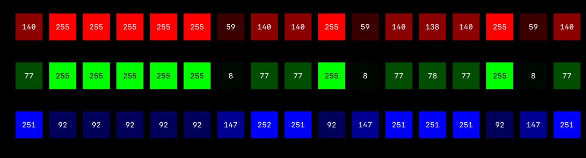

# QOI Format —— "相当好"的全新图像压缩详解

原项目地址: https://github.com/phoboslab/qoi
实现方案: https://github.com/Conless/HW1-QOI-Format-Codec

## 简介

QOI (The Quite OK Image Format, "相当好"的图像格式) 是一种全新的图像无损压缩规范, 由 Dominic Szablewski 发明并于 2021 年 11 月 24 日首次宣布. 这是一种比 PNG 更容易实现, 更快, 无损的压缩方式, 开源于 [Github](https://github.com/phoboslab/qoi). 官方公告与视频显示, 其编码速度比 PNG 格式快 20-50 倍, 解码速度快 3-4 倍, 压缩大小与 PNG 相似.

该项目也是上海交通大学致远学院 ACM 班的第一次程序设计大作业, 笔者在助教的讲解中了解到了 QOI 的实现原理和方法, 并补充了作业中的部分核心代码, 下面对其原理与代码进行讲解.

有能力的同学结合 [油管视频](https://www.youtube.com/watch?v=EFUYNoFRHQI) 观看效果更佳.

## 原理

我们知道, 相比于 JPEG 的有损压缩, PNG 能够通过记录每一个像素点的完整信息来达到恢复图像原始信息的目的. 其使用前向引用的方式进行压缩, 根本原理是实现对此前出现过的像素点或像素组合的复现, 并通过图像特征决定滤波器的选择和使用, 最大限度地压缩图像大小. 但所谓有得必有失, PNG 图像在压缩的过程中需要大量检索前向引用与图像特征, 造成了较大的时间损耗. 

于是, QOI 应运而生, 其编码过程只需要读取此前的一个像素点, 而不用大量检索, 同时还进行了极致的空间压缩, 实现了时间与空间的统一. 下面介绍其编码解码原理.



首先, 我们原样存入整张图片的第一个像素点, 即其在 RGB 三个通道上的值 (此处仅对 RGB 格式压缩说明, 下同), 可以记为

```cpp
data[0] = QOI_ORIGIN_TAG; // 原样输出的标识符
data[1] = r;
data[2] = g;
data[3] = b;
```

如果每一个都是这样输出, 那么显然会占据巨大的空间, 因此, 从第二个开始, QOI 就对像素点信息的储存进行了优化. 

## 说明文档

下面的内容是对项目的[说明文档](https://qoiformat.org/qoi-specification.pdf) 的翻译与解释, 配合原文档观看效果更佳. 

一个 QOI 文件中写入了一个 14 字节的起始标记, 若干组数据以及一个 8 字节的结束标记. 其中起始标记的构成为

```cpp
qoi_header {
    char magic[4];      // 类型标识符
    uint32_t width;     // 图像宽度
    uint32_t height;    // 图像高度
    uint8_t channels;   // 图像信息(RGB/RGBA)
    uint8_t colorspace; // alpha通道与颜色通道的信息
};
```

其中后面两个数据 (channels 与 colorspace) 只是标识符, 并不会改变编码方式. 随后图像就会从上到下, 从左到右地进行编码, 


